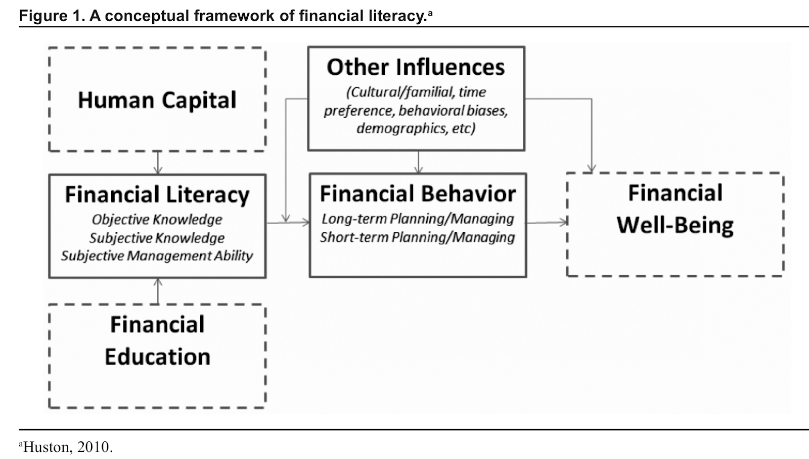

# Introduction
The purpose of this study was to examine the relationship between psychological factors such as stress or anxiety and the positive financial behavior of having three months of expenses in an emergency or rainy day fund. Psychological factors were measured as responses to four questions in the National Financial Capability Study (NFCS) survey. The questions covered satisfaction with financial condition, anxiety when thinking about finances, how respondents felt about their level of debt and how confident they were in their financial knowledge. The findings were that these psychological factors appear to be good predictors of a respondent having an emergency fund.

# Literature Review
A central theme of research related to financial literacy has been that more knowledge leads to wiser financial decisions. Henager and Cude (Henegar & Cude, 2016) have studied financial decisions made by individuals and have found that objective knowledge of financial understanding are associated with making positive short-term and long-term financial decisions. In this case, the objective knowledge was determined by a set of six questions that ranged from interest rates and bond prices to mortgage interest calculation. Questions that economists would think a rational citizen (an "econ") should know. They also assessed subjective financial knowledge and found that it also associates. Confidence in one self about a certain topic matters in how well you perform in it. 

Henegar and Cude utilized the conceptual framework from Huston (Huston, 2010) (see Figure 1) where she created a standardized framework to help future researchers have a guide to follow when it comes to addressing financial literacy. This research paper will be utilizing the infographic that was created by Henegar and Cude in their 2016 paper (Henegar & Cude, 2016 p. 5). Huston created this framework around the time of the Great Recession of 2008-2009 and had been inspired to do so as a result of “the recent mortgage crisis, consumer overindebtedness and household bankruptcy rates.” According to Huston, financial literacy was being given little attention on how it was measured. Her long-term goal is to help build up research on the measurement of financial literacy so that comparison studies can be done and/or meta-analysis. This article will aim to add to that data by studying influences that do not appear to have been given much focus in the latest research.

Besides objective knowledge or confidence in one's financial knowledge, there are also other factors that influence a person's financial behavior. Henegar and Cude pointed out age groups as an "other influence" that they focused on in their 2016 research using the same NFCS database (Henegar & Cude 2016). This research paper will be attempting to assess psychological effects such as stress and anxiety to see how they play a role in how a person behaves, including how they make financial decisions. Following Huston's framework of financial literacy, these psychological effects fall into the "other influences." Attempting to fill the gap of finding associations between psychological factors and financial well-being is what serves as the motivation for this research paper which will be focusing on the psychological questions from the NFCS study.

# Hypothesis
Based on Huston’s conceptual framework of financial literacy, there are many different influences that affect financial behavior which help determine how financial well-being is determined. This article will be focusing on the “Other Influences” portion of the conceptual framework in helping to try to explain a specific financial behavior, saving for an emergency fund. An emergency fund is generally thought of as three months of expenses in a bank account ready to be deployed in case of an emergency. Emergency savings can come in many forms besides a savings account, they can range from a plot of land to an inheritance. But in the case of this article, we will be focusing on the question “Have you set aside emergency or rainy day funds that would cover your expenses for 3 months, in case of sickness, job loss, economic downturn, or other emergencies?” from the NFCS questionnaire (attached: NFCS_2018_State_by_State_Qre.pdf).

This research paper’s hypothesis starts with the premise that having an emergency fund is a positive financial behavior, similar to how other researchers including Henegar and Cude have categorized it.. Many events cannot be anticipated which is why an emergency fund is necessary to be able to smooth out levels of consumption. That is why this question was included in the NFCS survey and also as a dependent variable in Henegar and Cude’s 2016 and 2019 study of the NFCS data (Henegar and Cude, 2016 p.7 & 2019 p.565). The motivation for focusing on this variable is born from personal experience and in seeing the usefulness of having such emergency funds available at hand.

The overall goal of this study is to assess the likelihood of someone having an emergency fund based on certain key psychological-related variables and evaluate how these vary with underlying demographic characteristics. 

Based on the above discussion, the following hypothesis was tested:

After controlling for other demographic characteristics, high stress and high anxiety positively predict a person to have an emergency fund.

# Methods 
## *Data and Sample*
The dataset this article uses is from the National Financial Capability Study (NFCS) which was funded by the FINRA Investor Education Foundation and conducted by ARC Research. The data can be downloaded here: https://www.usfinancialcapability.org/downloads.php. This study has been conducted in 2009, 2012, 2015, and 2018. We will be using the 2018 dataset. This data was collected by the FINRA foundation through ARC Research online from June through October 2018 among a nationally-representative sample of 27,091 American adults, reaching approximately 500 individuals per state, plus the District of Columbia (FINRA, 2018). The final sample used was 25,858 as the observations who answered “Don't know" or "Prefer not to say" to the emergency fund question were excluded.

## *Dependent Variable*
Descriptions of dependent and independent variables used in this research are detailed in Table 1.

The dependent variable will be question #J5 in the 2018 NFCS survey: Have you set aside emergency or rainy day funds that would cover your expenses for 3 months, in case of sickness, job loss, economic downturn, or other emergencies? The available answers were: "Yes," "No," "Don't know," and "Prefer not to say." A binary variable was created where "1" corresponding to "Yes" and "0" corresponding to "No" this individual did not have an emergency fund. Responses where the answers were "Don't know" or "Prefer not to say" were not included in the analysis.

## *Independent Variables*
The primary focus of this research are the psychological factors such as stress and anxiety that can affect financial behavior. In the survey, four questions were asked of the respondents that focused on how they felt about their finances and how thinking or talking about their finances made them feel.

The first question asks the respondent to think about their assets, debts and savings and to rate on a scale of 1 (Not At All Satisfied) to 10 (Extremely Satisfied) how satisfied they were with their current financial situation. This question appears to be rating how well a respondent is doing in financial terms by asking about assets, debts and savings, but it is actually asking how satisfied the respondent is with their own personal financial situation. So someone who has a high income can still give a low satisfaction rating when in fact they could be financially better off than a low income respondent who rates themselves with a higher satisfaction rating. 

The next two questions ask the respondent if they feel stressed or anxious when thinking about or talking about their finances. These two questions help the research in gauging how a respondent feels about their financial picture as a whole. The range of answers given allow the respondent free range to give a response appropriate for them. With “1” being “strongly disagree” and “7” being “strongly agree” these responses will allow the research to see how stress and anxiety factor into someone’s decision to have an emergency fund or not.

The last question asks the respondent if they feel they have too much debt right now. Once again, this question asks how the respondent feels about their personal financial situation with the same range of responses allowed as the previous two questions.

These four questions along with underlying demographic characteristics will help guide this research towards focusing on how psychological factors influence an important short-term financial behavior, saving for an emergency fund.

A final variable of subjective financial knowledge (confidence) is included as an independent variable into this research so that we can see the interaction effects with one of our key independent variables related to anxiety. Subjective financial knowledge has already been concluded by Henegar and Cude in their two studies to be positively associated with short-term financial behaviors, of which the three-month emergency fund question that is being studied here in this research is included in (Henagar & Cude, 2016, p.7) (Henagar & Cude, 2019, p.567).

## *Multicollinearity*
Of these five key independent variables, the questions asking about “stress” and “anxiety” had some correlations with one another, indicating that these two questions were possibly measuring the same thing. The correlation coefficient was 0.67. This means that both variables had some correlation with each other. Further checks for multicollinearity were done on the independent variables being included using Generalized Variance Inflation Factor (GVIF) and found the anxiety question to have a GVIF of 2.50 and the Stress question to have a GVIF of 2.44. Also, these two questions were grouped together under the same question (“How Strongly do you agree or disagree with the following statements?”) as sub-questions. Lastly, the proportion of respondent’s answers to these two questions were similar in the high, moderate and low categories (High/Medium/Low - Anxiety:0.54/0.17/0.29; Stress 0.44/0.19/0.37). So based on these points we will exclude one of the two questions from the statistical models as both appear too similar. The stress question will be excluded as the framing of that question includes the words “make my heart race” which seems more specific than the anxious question at assessing the respondent's psychological mindset. While the aim of this research study is to assess on a general level of psychological stress/anxiety.

## *Data Analysis Procedures*
A logistic regression is used in this research, with the emergency fund question as the dependent variable coded as a binary variable of “1” for “Yes” and “0” for “No” and the four independent variables as regressors along with other demographic data. As our dependent variable is categorical, a logistic regression is used so that we can see the likelihood of a respondent having an emergency fund based on the answers they provided on the four key independent variables. The Generalized Variance Inflation Factor was also run to check for multicollinearity among the four key independent variables and demographic variables and there appears to be no multicollinearity amongst the variables with GVIF scores ranging from 1.05 - 1.85.

Since we have coded the scales (1-10 & 1-7) into three categories for each question into Low, Moderate or High, one of the three will be dropped when the logistic regression is run so that one serves as the reference group the other two will be compared to. In order to address the hypothesis, we will be choosing which of the three variables will drop that is of least importance to addressing the hypothesis. Namely, for the financial condition question, we will let the regression drop “High Satisfaction” as a respondent who is highly satisfied with their financial condition does not fit within the hypothesis’ scope of stress, anxiety and worrying psychological factors. For the anxiety question, we will let “Low Anxiety” drop. For the debt question, we will let “Low Debt” drop. And for the confidence question, we will let “High Confidence” drop.

First, a logistic regression was run on the four key independent variables along with the demographic variables to see the effect each variable has on the likelihood of having an emergency fund.

Next, we will run the logistic regression with an interaction term between the subjective financial knowledge (confidence) variable and the variable assessing a respondent’s overall financial condition. This will help us see how confidence in a respondent’s own financial knowledge relates to how satisfied they are with their financial situation and how that helps determine their likelihood of having an emergency fund.

## *Descriptive Statistics*
Descriptive statistics are reported in Table 2. 

About half (52%) of the sample stated they had a set aside three months of expenses as an emergency fund. For the question about satisfaction with their financial condition, exactly a third (33%) stated they were highly satisfied with their financial situation and a little less than a third (26%) stated they leaned towards not satisfied at all. But most answered that they were moderately satisfied at 42%. The question on anxiety had the largest share of “High” ratings at 54% of all the four questions we included in our research. This means they rated their anxiety between 5-7 on a scale of 1-7. For the question about their assessment of how they feel about their debt, a majority indicated they either agree or disagree. 38% leaned towards agree and 47% leaned towards disagree. Only 15% of people felt indifferent about their debt. As for the last question on how confident a respondent was about their overall financial knowledge, most rated themselves a 5-7 on a scale from 1-7 at 74%. This appears quite high but could also be attributable to the overconfidence bias. 

# Results
## *Psychological effects on likelihood of having an emergency fund*
Table 3 reports the results of the logistic regression run on the full sample but specifically for the independent variables. The independent variables we chose to represent the psychological factors that we were assessing for predicting power appear to be significant and able to predict that a person who shows high anxiety about their finances, low satisfaction with their finances and/or feelings of too much debt has an emergency fund. 
The regression results appear to show that those who are under psychological anxiety, are feeling low about their financial condition or feel they have too much debt have higher odds of having an emergency fund. The respondents who reported “High” anxiety appear to have 50% higher odds than someone who reported “Low” anxiety to have an emergency fund. While someone who reported to be feeling “Low” about their overall financial condition has 8.92 times higher odds than someone who feels “High” about their overall financial condition. And someone who answered “High” on the debt question has 3.32 times higher odds than someone who reported “Low” to that question to have an emergency fund.
The hypothesis of psychological factors such as high anxiety being a predictor variable for the presence of an emergency fund appears to be supported.

To further check this pattern of relationships, the logistic regression was run again but with all other variables removed except for the four key variables displayed in Table 3. The results are displayed in Table 4 and the pattern of relationships appears to hold. 

As a robustness check against the model, we run another logistic regression with emergency fund as the dependent variable and the income groups as the independent variable. This will allow us to check if the opposite of our model of high anxiety and high debt is also true - those respondents with higher incomes will most likely not have a need for an emergency fund. We can see from this crosstab of the overall financial condition and income that lower incomes report closer towards the “1” range while those with higher incomes tend to report closer to “10” for the overall financial condition question.

The robustness check performed using incomes is displayed in Table 5 along with the crosstab in Table 5a. These tables confirm that as incomes increase, the odds drop dramatically for respondents to have an emergency fund. 

Next, we adjusted our model to include interaction terms to see the relationship between the subjective financial knowledge (confidence) variable with the anxiety variable. The confidence variable has already been tested by Henegar and Cude in their 2016 and 2019 study of the NFCS data where they found confidence in financial knowledge to be positively associated with positive short-term financial behavior (Henegar and Cude, 2016 p.12 & 2019 p.569). We would expect that respondents who have both lower confidence and higher anxiety to have a higher likelihood of having an emergency fund than respondents with higher confidence and/or lower anxiety than them. See Table 6 for logistic regression of interaction terms.

The odds ratios in Table 6 show the trend of higher anxiety and/or lower confidence indeed lead to higher odds of having an emergency fund. 

# Limitations
This study relied on data that was self-reported through an online environment that was not fully controlled by research administrators beyond the design of the questionnaire. For example, a respondent may feel pressure to answer “Yes'' on the emergency fund question as they may have felt they “should'' have an emergency fund but in fact they do not have one. Also, respondents may not be fully aware of their monthly expenses or may only know an estimated amount. This introduces the possibility of under and over estimating hence under and over exaggerated answers. Lastly, a respondent may have experienced a large financial event (either positive or negative) that may have affected how they answered if the event occurred around the time when they took the survey.

# Conclusion
The overall purpose of this study was to add to the literature on financial literacy by studying the relationship between psychological factors and the positive short-term behavior of saving for an emergency fund. In the preliminary research that was done for this research paper psychological factors did not appear to be factored into the models that were assessing financial well-being. Many research papers examined and found many other factors such as objective financial knowledge and subjective financial knowledge as positively associated with positive financial behaviors in the short and long-term. But there did not appear to be any focus on psychological factors, which was what inspired this research paper to focus on, to fill in the missing piece of the financial well-being puzzle.

A key finding was the significant, positive relationship found between high anxiety and likelihood of saving for an emergency fund. Other factors such as dissatisfaction with one’s overall financial situation or specifically with debt also appeared to be significantly and positively associated with a higher likelihood of saving for an emergency fund. 

The key finding factored in with levels of income can help us gain a better understanding as to the reasons why emergency savings are built up. Emergency savings is thought of as a positive financial behavior, which is what many researchers including Henegar and Cude identify it as. But what about the underlying cause or reason why someone would build up an emergency fund. Can we attempt to answer this question? 

Factoring in what we learned about the negative relationship between higher levels of income and likelihood of having an emergency fund with the psychological factors that this research paper found to associate with that outcome, we can see a plausible causation between lower levels of income, higher anxiety about finances and the likelihood of having an emergency fund. Evidence to further research into this plausible causation can be seen in the rising rates of emergency funds since the Great Recession of 2008-2009. The below graph shows the rising rates of emergency funds collected by the NFCS since 2009 (FINRA, 2018 Report of Findings p.15). This trend along with the variables listed imply that rates of people saving an emergency fund can be an indicator of negative financial health. This article understands this is contradictory to what researchers generally think of an emergency fund as, which is why further research would need to be done to dissect these differences between these variables to gain a better understanding of the cause of rising rates of emergency funds we are seeing in households.

# References
Beierlein JJ, Neverett M. Who takes personal finance? Financial Services Review. 2013;22(2):151-171. Accessed December 18, 2020. https://search-ebscohost-com.ccny-proxy1.libr.ccny.cuny.edu/login.aspx?direct=true&db=bth&AN=94644713&site=ehost-live

Despard MR, Friedline T, Martin-West S. Why Do Households Lack Emergency Savings? The Role of Financial Capability. Journal of Family and Economic Issues. 2020;41(3):542-557. Accessed December 18, 2020. https://search-ebscohost-com.ccny-proxy1.libr.ccny.cuny.edu/login.aspx?direct=true&db=ecn&AN=1848145&site=ehost-live 

Financial Industry Regulatory Authority. (2018). Financial capability in the United States: Report of findings from the 2018 National Financial Capability Study. FINRA Investor Education Foundation. Retrieved from https://www.usfinancialcapability.org/downloads.php NFCS_2018_Report_Natl_Findings.pdf

Financial Industry Regulatory Authority. (2018). Financial capability in the United States: State-by-State Survey Methodology from the 2018 National Financial Capability Study. FINRA Investor Education Foundation. Retrieved from https://www.usfinancialcapability.org/downloads/NFCS_2018_State_by_State_Meth.pdf

Henager, Robin and Cude, Brenda J. Financial Literacy and Long- and Short-Term Financial Behavior in Different Age Groups. Journal of Financial Counseling and Planning Vol 27, 3-19 (2016). https://connect.springerpub.com/content/sgrjfcp/27/1/3

Henager, R., Cude, B.J. Financial Literacy of High School Graduates: Long- and Short-Term Financial Behavior by Age Group. J Fam Econ Iss 40, 564–575 (2019). https://doi.org/10.1007/s10834-019-09626-2

Huston SJ. Measuring Financial Literacy. Journal of Consumer Affairs. 2010;44(2):296-316. Accessed December 18, 2020. https://search-ebscohost-com.ccny-proxy1.libr.ccny.cuny.edu/login.aspx?direct=true&db=ecn&AN=1112007&site=ehost-live

St. Louis Fed, (2020). “Student Loans Owned and Securitized, Outstanding”https://fred.stlouisfed.org/graph/?g=yTyF accessed Dec 18, 2020.

